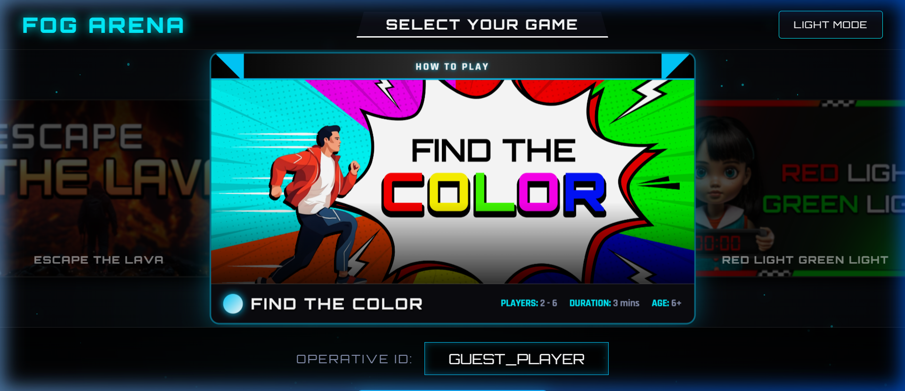
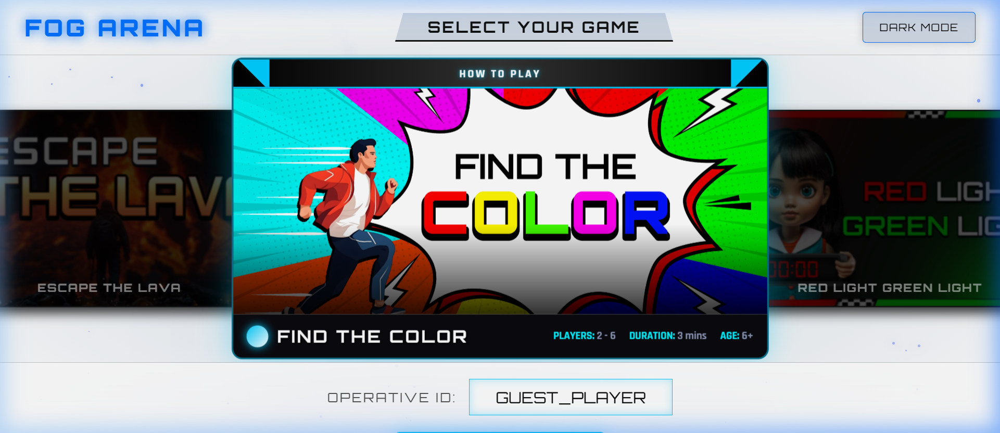
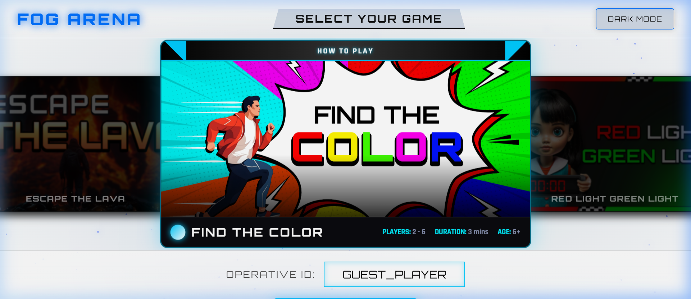

# FOG ARENA - Game Selection Interface



## Overview
**FOG ARENA** is a premium, high-performance game selection interface built for the FOG Technologies internship assignment. It features a cutting-edge Sci-Fi aesthetic, dynamic backgrounds, and a seamless user experience for selecting various gaming modules.

## Key Features

### 1. Dynamic Galaxy Background
Powered by **Framer Motion**, the interface features a procedurally generated starfield and glowing nebula blobs that drift and rotate infinitely, creating a deep space immersion.

### 2. 3D Coverflow Carousel
Utilizing **Swiper.js**, users can navigate through a library of games using a smooth 3D coverflow effect. Supporting keyboard and mousewheel navigation, it provides a tactile feel to game discovery.

### 3. Integrated 4K Video Previews
Each game card is equipped with high-fidelity native HTML5 video previews, allowing operatives to see the action before engaging the mission.

### 4. Interactive Theme Engine
A direct **Dark/Light Mode** toggle located in the top navigation bar allows for instant environment shifting. The entire UI color palette, including the galaxy star colors and nebula glows, adapts dynamically via CSS variables.

### 5. Operative ID System
Built-in alias input for tracking player identity across the FOG ecosystem, featuring a glowing interactive UI that reacts to the selected game's color scheme.

## Tech Stack
- **Frontend**: React.js (Vite)
- **Animations**: Framer Motion
- **Carousel**: Swiper.js
- **Styling**: Vanilla CSS with Dynamic Variables & Glassmorphism
- **Icons**: Custom SVG / Orbitron Typography

## Installation & Setup

1. **Clone the repository**:
   ```bash
   git clone https://github.com/code0era/FOG-Game-s-card-selection-UI.git
   ```

2. **Navigate to the directory**:
   ```bash
   cd GAME01_CARDS_SELECTION/fog-game-selector
   ```

3. **Install Dependencies**:
   ```bash
   npm install
   ```

4. **Run the Development Server**:
   ```bash
   npm run dev
   ```

## Development Credits
**MADE BY GRINDING THE NIGHT**  
© CODEERA PRODUCT 2026

---

### Screenshots

| Dark Mode Interface | Light Mode Interface |
| :---: | :---: |
|  |  |

| Game Card Detail | Operative Identification |
| :---: | :---: |
|  | *Glows adjust based on selection* |
